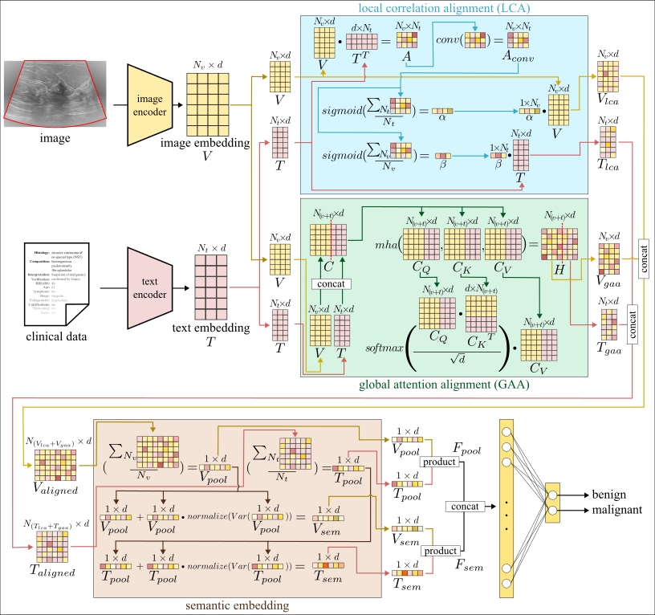

# DSMA-Breast

**A Dual-Stage Multimodal Alignment Approach for Robust Breast Cancer Diagnosis via Visual-Textual Computing**

<p align="center">
  <a href="https://doi.org/10.3390/app16125934"></a>
  
  
  
  
  
</p>

Official implementation of the paper published in *Applied Sciences* (MDPI):
[**A Dual-Stage Multimodal Alignment Approach for Robust Breast Cancer Diagnosis via Visual-Textual Computing**](https://doi.org/10.3390/app16125934), *Appl. Sci.* **2026**, *16*(12), 5934.

---

<p align="center">
  
</p>
<p align="center"><em>DSMA-Breast architecture. Reproduced from Dogan, R.O. (2026),
<i>Appl. Sci.</i> <b>16</b>, 5934, <a href="https://doi.org/10.3390/app16125934">doi:10.3390/app16125934</a>,
licensed under <a href="https://creativecommons.org/licenses/by/4.0/">CC BY 4.0</a>.</em></p>

---

## Overview

DSMA-Breast couples breast ultrasound (US) images with clinical-text descriptors through a two-stage alignment pipeline for benign-vs-malignant lesion classification under cross-domain shift:

- **Stage I — Local Correlation Alignment (LCA):** a small Conv2D module refines the cross-modal correlation matrix `A = V·T^T` to highlight fine-grained lesion-text correspondences.
- **Stage II — Global Attention Alignment (GAA):** multi-head self-attention over the joint visual-textual sequence captures long-range cross-modal dependencies.
- **Variance-aware Semantic Embedding (VASE):** amplifies high-variance dimensions of the pooled descriptors before fusion.
- **Cosine alignment loss** (`L_align`) pulls paired visual and textual representations closer in the shared latent space; the overall objective combines focal classification losses on both modalities with this alignment term.

The framework is evaluated under three protocols:
1. **Protocol I** — like-for-like benchmark on BUS-CoT against vision-language baselines.
2. **Protocol II** — pooled, leakage-free evaluation across six harmonized public datasets.
3. **Protocol III** — zero-shot cross-domain transfer (trained on multimodal sources, evaluated on unseen unimodal targets).

---

## Citation

If you use this code or build on this work, please cite:

> Dogan, R.O. A Dual-Stage Multimodal Alignment Approach for Robust Breast Cancer Diagnosis via Visual-Textual Computing. *Appl. Sci.* **2026**, *16*, 5934. https://doi.org/10.3390/app16125934

```bibtex
@Article{app16125934,
  author         = {Dogan, Ramazan Ozgur},
  title          = {A Dual-Stage Multimodal Alignment Approach for Robust Breast Cancer Diagnosis via Visual-Textual Computing},
  journal        = {Applied Sciences},
  volume         = {16},
  year           = {2026},
  number         = {12},
  article-number = {5934},
  url            = {https://www.mdpi.com/2076-3417/16/12/5934},
  issn           = {2076-3417},
  doi            = {10.3390/app16125934}
}
```

---

## Harmonized Public Datasets

All experiments rely exclusively on previously released, de-identified public datasets. Nothing is redistributed in this repository — each dataset must be obtained from its original distributor under its respective license.

| Dataset   | Year | Modality      | Source |
|-----------|------|---------------|--------|
| BUS-CoT   | 2026 | Image + Text  | [Figshare](https://doi.org/10.6084/m9.figshare.30838715) |
| BrEaST    | 2024 | Image + Text  | [TCIA](https://www.cancerimagingarchive.net/collection/breast-lesions-usg/) |
| BUS-BRA   | 2024 | Image         | [Zenodo](https://zenodo.org/records/8231412) |
| BUS-UCLM  | 2024 | Image         | [Mendeley Data](https://doi.org/10.17632/7fvgj4jsp7.1) |
| BLUI      | 2023 | Image         | [QAMEBI](https://qamebi.com/breast-ultrasound-images-database/) |
| BUSI      | 2020 | Image         | [Cairo Univ.](https://scholar.cu.edu.eg/?q=afahmy/pages/dataset) |

A helper script automates downloading, extracting, and converting all six datasets to the unified `dataset.json` schema used by the training code:

```bash
# fetch everything (default destination: ./datasets)
python tools/data_prep/fetch_datasets.py

# only a subset
python tools/data_prep/fetch_datasets.py --only BUSI BLUI

# rebuild dataset.json from already-downloaded zips
python tools/data_prep/fetch_datasets.py --skip-download
```

The downloader supports HTTP resume (large files such as the 6.9 GB BUS-CoT archive will continue from the last byte on retry), validates zip integrity, and is idempotent: existing downloads and extracted trees are reused. Each dataset must still be obtained from its original distributor under its respective license; the script merely retrieves and organizes the files for the training pipeline.

---

## Installation

The project targets Python 3.12 and PyTorch 2.9 with CUDA 13.

```bash
# clone
git clone https://github.com/doganr/DSMA-Breast.git
cd DSMA-Breast

# create the conda environment
conda env create -f environment.yml
conda activate dsma-breast
```

A modern NVIDIA GPU is recommended (the paper experiments were run on a single RTX A6000, 48 GB).

---

## Data Preparation

`fetch_datasets.py` (see the previous section) writes one `dataset.json` per
dataset folder. The remaining steps split BUS-CoT into the trainval/test
partition used in the paper and produce the leakage-free (LF) subsets:

```bash
# 1) Split the BUS-CoT dataset.json into trainval + test
python tools/data_prep/split_dataset.py

# 2) Produce the leakage-free trainval and test splits used by Protocol II
python tools/data_prep/build_lf_split.py --mode both

# 3) Verify image-level leakage between BUS-CoT and the other datasets via pHash
python tools/checks/check_leakage.py

# Optional sanity checks (source attribution, per-domain sample counts)
python tools/checks/check_dataset.py sources
python tools/checks/check_dataset.py sizes
```

The metadata-based filter in `build_lf_split.py` removes BUS-CoT entries whose
`BUS-Expert` source is BUS-BRA or BUSI (1553 of the original 5163 images),
leaving a strictly independent 3610-image LF subset. The pHash check is an
independent sanity verification; for the released data it reports only 8
residual near-duplicate pairs (Hamming distance ≤ 2), confirming that the
metadata-driven removal is comprehensive.

---

## Training

The main training entry point is `dsma/train.py`. A minimal run on the BUS-CoT + BrEaST multimodal pool looks like:

```bash
python dsma/train.py \
    --train_type multimodal \
    --vision_model google/vit-base-patch16-224 \
    --text_model emilyalsentzer/Bio_ClinicalBERT \
    --include_dirs "2024 - BrEaST" "2026 - BUS-CoT" \
    --output_dim 2 --class_names benign malignant \
    --fold 5 --epoch 30 --batch_size 16 \
    --fusion_stages both
```

Key arguments:

- `--train_type` — `multimodal`, `vision`, or `text`.
- `--fusion_stages` — `both` (default), `lca_only` (Stage I only), or `gaa_only` (Stage II only). The legacy aliases `ccm_only`/`mha_only` are still accepted.
- `--include_dirs` — subset of dataset folders to use (matches names in `datasets/`).
- `--epoch`, `--batch_size`, `--fold` — training schedule.

Each run writes its checkpoints, learning curves, confusion matrices, ROC curves, and Grad-CAM samples into a timestamped folder under `dsma/saved/`.

---

## Evaluation

```bash
# Domain generalization (Protocol III): train on source pool, test on unseen targets
python dsma/test_dg.py --model_dir dsma/saved/<run_folder>

# Ensemble evaluation on a held-out test split
python dsma/test_ensemble.py --model_dir dsma/saved/<run_folder>

# Grad-CAM visualizations for qualitative analysis
python dsma/test_gradcam.py --model_dir dsma/saved/<run_folder>/model_fold<k>_best.pth

# Post-hoc cross-validation metrics
python tools/analysis/compute_cv_metrics.py dsma/saved/<run_folder>

# Per-domain metric breakdown
python tools/analysis/domain_metrics.py dsma/saved/<run_folder> \
    --include_dirs "2024 - BrEaST" "2026 - BUS-CoT" \
    --class_names benign malignant
```

---

## Repository Structure

```
DSMA-Breast/
├── dsma/                              # Core training and evaluation package
│   ├── train.py                       # Main training entry point
│   ├── test_dg.py                     # Protocol III zero-shot DG evaluation
│   ├── test_ensemble.py               # K-fold ensemble inference
│   ├── test_general.py                # Single-checkpoint inference
│   ├── test_gradcam.py                # Grad-CAM visualizations
│   ├── data/                          # Dataset loaders & k-fold splitters
│   ├── models/                        # Vision / text / multimodal models
│   └── utils/                         # Metrics, losses, reporting, Grad-CAM
├── tools/
│   ├── data_prep/                     # Dataset preparation utilities
│   │   ├── fetch_datasets.py          # Download, extract & organize the six datasets
│   │   ├── build_buscot_splits.py     # Build BUS-CoT trainval/test dataset.json
│   │   ├── build_lf_split.py          # Build leakage-free LF splits (trainval + test)
│   │   └── split_dataset.py           # Generic train/val/test partitioner
│   ├── checks/                        # Dataset integrity / leakage audits
│   │   ├── check_leakage.py           # pHash near-duplicate scan
│   │   ├── check_dataset.py           # Source attribution / per-domain counts
│   │   └── leakage_report.json        # pHash scan result (8 near-duplicate pairs)
│   ├── analysis/                      # Post-hoc analysis & reporting
│   │   ├── compute_cv_metrics.py      # Aggregate CV metrics
│   │   ├── domain_metrics.py          # Per-domain metric helpers
│   │   ├── investigate_folds.py       # Fold-level diagnostics
│   │   └── generate_reports.py        # Publication-ready figures
│   ├── monitor.py                     # GPU/CPU monitoring helper
│   └── run_tests.sh                   # Batch evaluation script
├── environment.yml                    # Conda environment
└── LICENSE
```

---

## License

Released under the [MIT License](LICENSE). Note that the public datasets used in this work retain their original licenses; please consult each dataset's source for terms of use.

---

## Contact

**Ramazan Özgür Doğan**
Department of Artificial Intelligence Engineering
Faculty of Computer and Information Sciences
Trabzon University, Trabzon, Türkiye

Email: [dogan@trabzon.edu.tr](mailto:dogan@trabzon.edu.tr)

---

*If you use this code in your research, please cite the paper above.*
